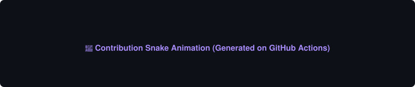
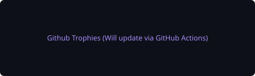
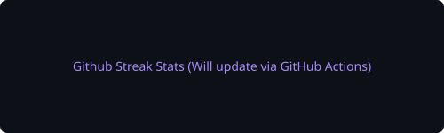

<div align="center">

<!-- Header Waving Banner -->


<!-- Typing Animation -->
<a href="https://git.io/typing-svg">
  
</a>

<!-- Profile Badges -->

&nbsp;&nbsp;
<a href="https://github.com/AIOmarRehan?tab=followers">
  
</a>
&nbsp;&nbsp;


</div>

<!-- Animated Separator -->


<br/>

<!-- About Card -->
<table align="center" width="100%">
<tr>
<td style="background-color: #0d1117; border: 1px solid #4c1d95; border-radius: 16px; padding: 20px;">
<div style="display: flex; align-items: center; border-bottom: 1px solid #30363d; padding-bottom: 12px; margin-bottom: 16px;">
  <span style="display: inline-block; width: 12px; height: 12px; border-radius: 50%; background-color: #ff5f56; margin-right: 8px;"></span>
  <span style="display: inline-block; width: 12px; height: 12px; border-radius: 50%; background-color: #ffbd2e; margin-right: 8px;"></span>
  <span style="display: inline-block; width: 12px; height: 12px; border-radius: 50%; background-color: #27c93f; margin-right: 16px;"></span>
  <span style="color: #8b949e; font-family: monospace; font-size: 13px;">profile.yaml</span>
</div>

```yaml
developer:
  name: Omar Rehan
  role: AI Engineer & Full-Stack Developer
  location: Dubai, United Arab Emirates
  education: B.Sc. Computer Science
  website: omar-rehan.vercel.app
  status: Open to Work / Seeking Opportunities

professional_summary: |
  I am Omar Rehan, an AI Engineer and Full-Stack Developer based in Dubai, UAE.
  I specialize in bridging the gap between deep learning models (Computer Vision,
  Vision-Language models) and production-grade web applications.

core_principles_and_vision:
  pragmatic_ai_deployment: |
    I believe AI models must be packaged and deployed efficiently via FastAPI,
    Docker, and HuggingFace Spaces to solve real-world problems.
  deep_technical_specialization: |
    Actively fine-tuning state-of-the-art models like Qwen2.5-VL and Llama 3.2 Vision
    for niche applications including astronomy and satellite imagery classification.
  clean_architecture_and_code: |
    Whether training neural networks in PyTorch or building Next.js applications,
    I write maintainable, clean code and design intuitive user interfaces.
```

</td>
</tr>
</table>

<br/>


## Technology Stack

<div align="center">

<table width="100%">
<tr>

<!-- AI / ML Card -->
<td align="center" width="50%" valign="top" style="border: 1px solid #4c1d95; border-radius: 12px; padding: 16px; background-color: #0d1117;">
<h3>AI & Machine Learning</h3>

<br/><br/>


<br/>


</td>

<!-- Languages Card -->
<td align="center" width="50%" valign="top" style="border: 1px solid #4c1d95; border-radius: 12px; padding: 16px; background-color: #0d1117;">
<h3>Programming Languages</h3>

<br/><br/>


<br/>


</td>

</tr>
<tr>

<!-- Web & Cloud Card -->
<td align="center" width="50%" valign="top" style="border: 1px solid #4c1d95; border-radius: 12px; padding: 16px; background-color: #0d1117;">
<h3>Web & Cloud Platforms</h3>

<br/><br/>


<br/>


</td>

<!-- DevOps & Tools Card -->
<td align="center" width="50%" valign="top" style="border: 1px solid #4c1d95; border-radius: 12px; padding: 16px; background-color: #0d1117;">
<h3>DevOps & Development Tools</h3>

<br/><br/>


<br/>


</td>

</tr>
</table>

</div>

<br/>


## GitHub Analytics

> [!NOTE]
> All statistics below are locally cached and refreshed twice daily via GitHub Actions. This prevents downtime, resolves the rate-limit errors, and guarantees instantaneous loading.

<div align="center">

<!-- Contribution Snake Animation -->
<h3>Contribution Snake Animation</h3>


<br/><br/>

<!-- Contribution Activity Graph -->
<h3>Contribution Activity Graph</h3>


<br/><br/>

<!-- Row of Trophies and Streak -->
<table width="100%" border="0">
<tr>
<td align="center" width="50%" valign="top">
  <h4>GitHub Achievements</h4>
  
</td>
<td align="center" width="50%" valign="top">
  <h4>Contribution Streak</h4>
  
</td>
</tr>
</table>

<br/>

<!-- Shields.io Badges -->

&nbsp;&nbsp;


</div>

<br/>


## Featured Projects

<div align="center">

### Computer Vision & Deep Learning

<table width="100%">
<tr>
<td width="50%" valign="top" style="border: 1px solid #4c1d95; border-radius: 12px; padding: 16px; background-color: #0d1117;">
<h4 align="center"><a href="https://github.com/AIOmarRehan/yolov8-obb-sar-vehicle-detection">YOLOv8 OBB SAR Vehicle Detection</a></h4>
<p align="center">Oriented bounding box vehicle detection in SAR imagery using YOLOv8.</p>
<p align="center">
  
  
  
</p>
</td>
<td width="50%" valign="top" style="border: 1px solid #4c1d95; border-radius: 12px; padding: 16px; background-color: #0d1117;">
<h4 align="center"><a href="https://github.com/AIOmarRehan/Brain-Tumor-Classification-with-Grad-CAM">Brain Tumor Classification & Grad-CAM</a></h4>
<p align="center">Deep learning classification on Brain MRI with Gradient-weighted Class Activation Mapping explainability.</p>
<p align="center">
  
  
  
</p>
</td>
</tr>
<tr>
<td width="50%" valign="top" style="border: 1px solid #4c1d95; border-radius: 12px; padding: 16px; background-color: #0d1117;">
<h4 align="center"><a href="https://github.com/AIOmarRehan/ResNet50V2-Powered-COVID-19-Classification-on-Chest-X-ray-Images">COVID-19 Chest X-Ray Classifier</a></h4>
<p align="center">ResNet50V2-powered COVID-19 detection from chest X-ray scans with advanced data augmentations.</p>
<p align="center">
  
  
  
</p>
</td>
<td width="50%" valign="top" style="border: 1px solid #4c1d95; border-radius: 12px; padding: 16px; background-color: #0d1117;">
<h4 align="center"><a href="https://github.com/AIOmarRehan/High-Accuracy-Cats-vs-Dogs-InceptionV3">Cats vs Dogs — InceptionV3</a></h4>
<p align="center">High-accuracy binary image classifier using InceptionV3 transfer learning and fine-tuning.</p>
<p align="center">
  
  
  
</p>
</td>
</tr>
<tr>
<td width="50%" valign="top" style="border: 1px solid #4c1d95; border-radius: 12px; padding: 16px; background-color: #0d1117;">
<h4 align="center"><a href="https://github.com/AIOmarRehan/CNN_Autoencoder_For_Image_Denoising">CNN Image Denoising Autoencoder</a></h4>
<p align="center">Convolutional autoencoder architecture designed to compress and denoise dirty image inputs.</p>
<p align="center">
  
  
  
</p>
</td>
<td width="50%" valign="top" style="border: 1px solid #4c1d95; border-radius: 12px; padding: 16px; background-color: #0d1117;">
<h4 align="center"><a href="https://github.com/AIOmarRehan/PyTorch_CNN_vs_Transformer_vs_Xception">CNN vs Transformer vs Xception</a></h4>
<p align="center">Comparative study of CNN, Vision Transformer (ViT), and Xception networks in PyTorch.</p>
<p align="center">
  
  
  
</p>
</td>
</tr>
</table>

<br/>

### Vision-Language Models (VLMs)

<table width="100%">
<tr>
<td width="50%" valign="top" style="border: 1px solid #4c1d95; border-radius: 12px; padding: 16px; background-color: #0d1117;">
<h4 align="center"><a href="https://github.com/AIOmarRehan/fine-tuning-qwen2-5-vl-astronomy">Fine-Tuning Qwen2.5-VL for Astronomy</a></h4>
<p align="center">Fine-tuning Qwen2.5 Vision-Language model on astronomy domain data using LoRA.</p>
<p align="center">
  
  
  
</p>
</td>
<td width="50%" valign="top" style="border: 1px solid #4c1d95; border-radius: 12px; padding: 16px; background-color: #0d1117;">
<h4 align="center"><a href="https://github.com/AIOmarRehan/Unsloth_Llama_3.2_11B_Vision_Instruct_Astronomy">Llama 3.2 11B Vision — Astronomy</a></h4>
<p align="center">Efficient fine-tuning of Llama 3.2 11B Vision Instruct with Unsloth on specialized tasks.</p>
<p align="center">
  
  
  
</p>
</td>
</tr>
</table>

<br/>

### Full-Stack & Web Applications

<table width="100%">
<tr>
<td width="50%" valign="top" style="border: 1px solid #4c1d95; border-radius: 12px; padding: 16px; background-color: #0d1117;">
<h4 align="center"><a href="https://github.com/AIOmarRehan/My_Portfolio">My Portfolio</a></h4>
<p align="center">Personal portfolio website showcasing AI projects, web applications, and developer bio.</p>
<p align="center">
  
  
  
</p>
</td>
<td width="50%" valign="top" style="border: 1px solid #4c1d95; border-radius: 12px; padding: 16px; background-color: #0d1117;">
<h4 align="center"><a href="https://github.com/AIOmarRehan/RehanPulse">RehanPulse</a></h4>
<p align="center">A real-time pulse and physical activity monitoring web dashboard.</p>
<p align="center">
  
  
  
</p>
</td>
</tr>
<tr>
<td width="50%" valign="top" style="border: 1px solid #4c1d95; border-radius: 12px; padding: 16px; background-color: #0d1117;">
<h4 align="center"><a href="https://github.com/AIOmarRehan/TerraExplorer">TerraExplorer</a></h4>
<p align="center">Interactive geospatial exploration and visualization platform for GIS data.</p>
<p align="center">
  
  
  
</p>
</td>
<td width="50%" valign="top" style="border: 1px solid #4c1d95; border-radius: 12px; padding: 16px; background-color: #0d1117;">
<h4 align="center"><a href="https://github.com/AIOmarRehan/Finance-Tracker">Finance Tracker</a></h4>
<p align="center">Personal finance management app for tracking income, expenses, and monthly budget targets.</p>
<p align="center">
  
  
  
</p>
</td>
</tr>
</table>

</div>

<br/>


## Contact

<div align="center">

<a href="https://github.com/AIOmarRehan">
  
</a>
&nbsp;
<a href="https://linkedin.com/in/omar-rehan-47b98636a">
  
</a>
&nbsp;
<a href="https://medium.com/@ai.omar.rehan">
  
</a>
&nbsp;
<a href="https://www.kaggle.com/aiomarrehan">
  
</a>
&nbsp;
<a href="https://huggingface.co/AIOmarRehan">
  
</a>

<br/><br/>

<a href="https://omar-rehan.vercel.app">
  
</a>
&nbsp;
<a href="mailto:ai.omar.rehan@gmail.com">
  
</a>
&nbsp;
<a href="https://wa.me/971509669311">
  
</a>

<br/><br/>


</div>

<br/>

<!-- Footer Waving Banner -->

